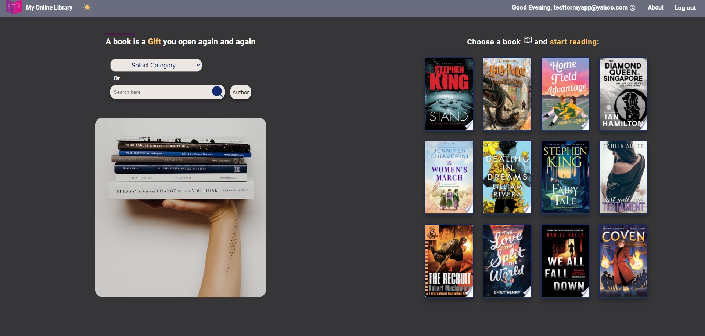

 <h1 align="center">📖 Welcome to My Online Library! 📖 </h1>

 📚 <strong> A Full-stack MERN App </strong>as a final project for the concordia WebDev Bootcamp.

📚 Makes uses of <strong>HTML </strong>, <strong>CSS </strong>, <strong> ES6 JavaScript</strong>, and <strong> React</strong> on the FE, <strong> NodeJS</strong>, <strong> ExpressJS </strong>, and <strong> MongoDB </strong> on the BE. 

📚 The APIs:  <a href="https://developers.google.com/maps"> <strong>Google Map API </strong> </a>, <a href="https://auth0.com/docs/quickstart/spa/react/interactive"> <strong>Auth0</strong> </a>, and <a href="https://developers.google.com/books"> <strong>Google Books API</strong> </a> 

📚 In this App, you can search for books by category, title or author. 

📚 When you choose a book, you'll have access to some details about that book including title, author, publisher, category, pages and description.

📚 Based on the category of the book, some other books in the same category will be suggested to user.

📚 If you login to the website, it gives you access to more features. You can write comments and read other people's 
comments about different books. You can edit or delete your own comments. Furthermore, you can add books to your favorite
list and create your personal library in your profile page. 

📚 <a href="https://developers.google.com/maps"> Google Map API </a> provides location of a library that has that book 

📚 <a href="https://auth0.com/docs/quickstart/spa/react/interactive"> Auth0 </a> provides a secure and fast log in. 

📚 <a href="https://developers.google.com/books"> Google Books API </a> is used to search content and organize an authenticated user's personal library. 

📚 A Dark Theme is also included.

 Click <a href="https://my-online-library.onrender.com/"><strong> Here</strong> </a> to view the deployed website at render.com 

Recently I was working on responsiveness of this website on mobile devices and it was quite a challenge for me.  

#### Screenshot of home page

#### Screenshot of book details page

#### Screenshot of showing library on google map

#### Screenshot of category search page

#### Screenshot of about page

#### Screenshot of profile page

