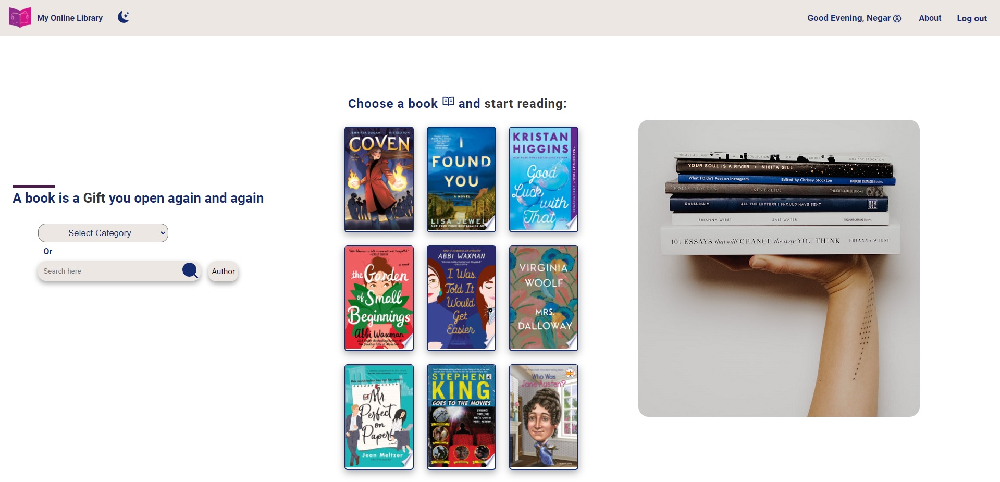

# Final-project - My Online Library
## Hello and welcome to "My Online Library"

A Full-stack MERN App as a final project for the concordia WebDev Bootcamp. 
In this website you can search for books by category, title or author.
When you choose a book, you'll have access to some details about that book including title, author, publisher, category, pages and description.
Google Map API was also used to render a map for a library that has that book.
Based on the category of that book, some other books in the same category will be suggested to user.
Some books have an available ebook that you can start reading in google books website.
If you login to the website, it gives you access to more features. You can write comments and read other people's 
comments about different books. You can edit or delete your own comments. Furthermore, you can add books to your favorite
list which will be shown in your profile page.
A Dark Theme is also included.
Click on the image below to view the deployed website at onrender.com

For this project I decided to use 3 API for the first time: Google Map API, Auth0 and Google Books API. Google Map is used to render a map for each library, Auth0 is use to have a secure and fast log in and Google Books API is used to search content and organize an authenticated user's personal library.

Recently I was working on responsiveness of this website on mobile devices and it was quite a challenge for me.

#### Screenshot of home page

#### Screenshot of book details page

#### Screenshot of showing library on google map

#### Screenshot of category search page

#### Screenshot of about page

#### Screenshot of profile page

